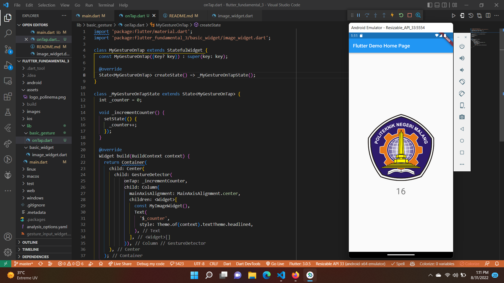
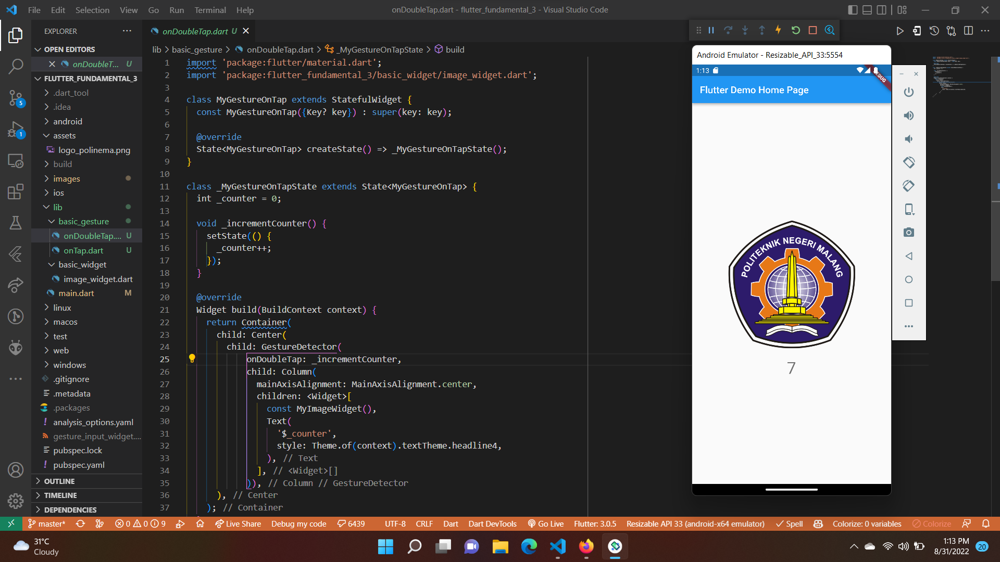
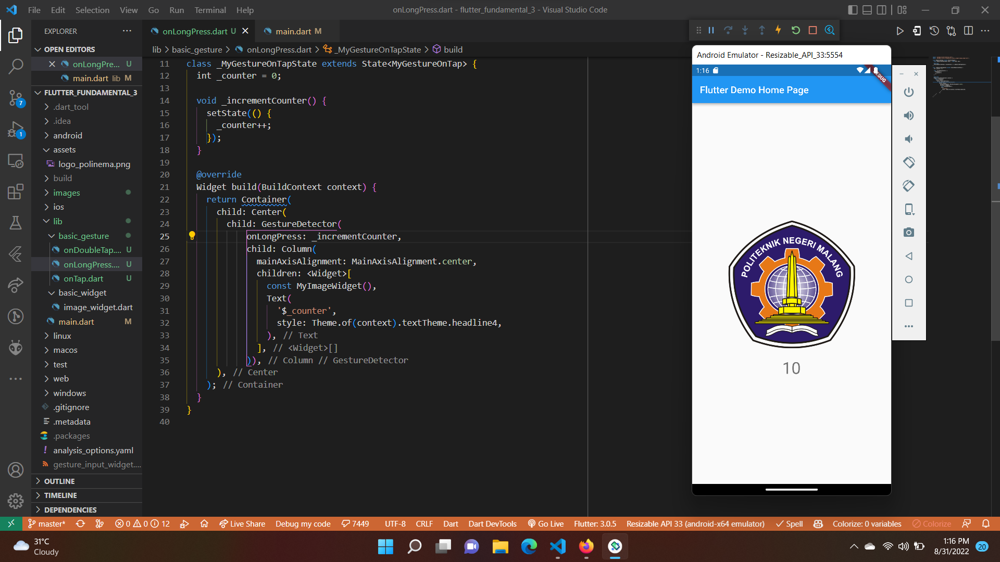
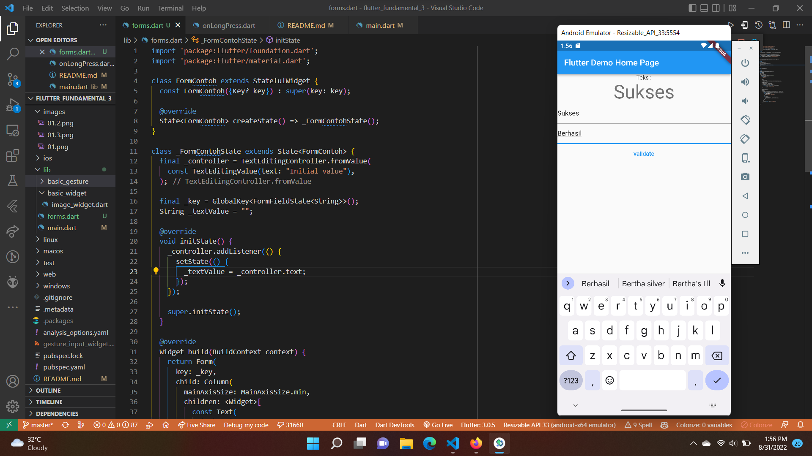

# Flutter Fundamental - Bagian 3

## Tujuan Praktikum

Setelah menyelesaikan codelab ini Anda akan mampu untuk:

* Menerapkan jenis-jenis gesture
* Menerapkan input widget dan controllernya
* Menerapkan custom input dan FormField widget

## Praktikum 1: Menerapkan Gesture Detector

Jika Anda coba klik/tap pada gambar, maka angka di bawah akan terus bertambah. Mengapa demikian?

* Karena terdapat widget GestureDetector yang membungkus sebuah widget onTap yang berisi function _incrementCounter. Serta ada juga widget image dan widget text di GestureDetector ini. Sehingga jika di klik sekali maka akan menjalankan function _incrementCounter.

### Eksperimen Jenis Gesture Lain

#### On Double Tap

* Pada gesture (On Double Tap) ini, kita perlu klik gambar sebanyak 2 kali untuk melakukan increment angka.

#### On Long Press

* Pada gesture (On Long Press) ini, kita perlu klik tahan agak lama untuk melakukan increment angka.

## Praktikum 2: Menerapkan Input Widget dan Forms

* Menggunakan GlobalKey adalah cara yang disarankan untuk mengakses formulir. Namun, jika Anda memiliki pohon widget yang lebih kompleks, Anda bisa menggunakan metode Form.of() untuk mengakses formulir di dalam widget bersarang.

* TextFormField membungkus TextField dan mengintegrasikannya dengan Formulir terlampir. Ini menyediakan fungsionalitas tambahan, seperti validasi dan integrasi dengan widget FormField lainnya.

* Validasi input dengan menyediakan fungsi validator() ke TextFormField. Jika input pengguna tidak valid, fungsi validator mengembalikan String yang berisi pesan kesalahan. Jika tidak ada kesalahan, validator harus mengembalikan null.

* AddListener() berfungsi untuk mencetak nilai terbaru, dengarkan controller untuk perubahan.

